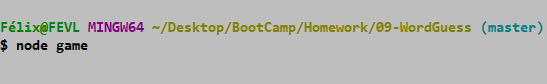

# Guess the GOT House - CLI App
***
## Description  
Command Line word guess game using the Game of Thrones houses!
***

## Libraries
   * [Inquirer](https://www.npmjs.com/package/inquirer)

***
## Notes

* You can choose to play between 1 & 22 houses
* You have 10 tries for each house
  *  To run the game type <node game>
   > 
  *  You will have to select between 1 & 22 houses for the game
   >      
  *  Keep typing single characters [a-z], until you guess the house
   >  

***
